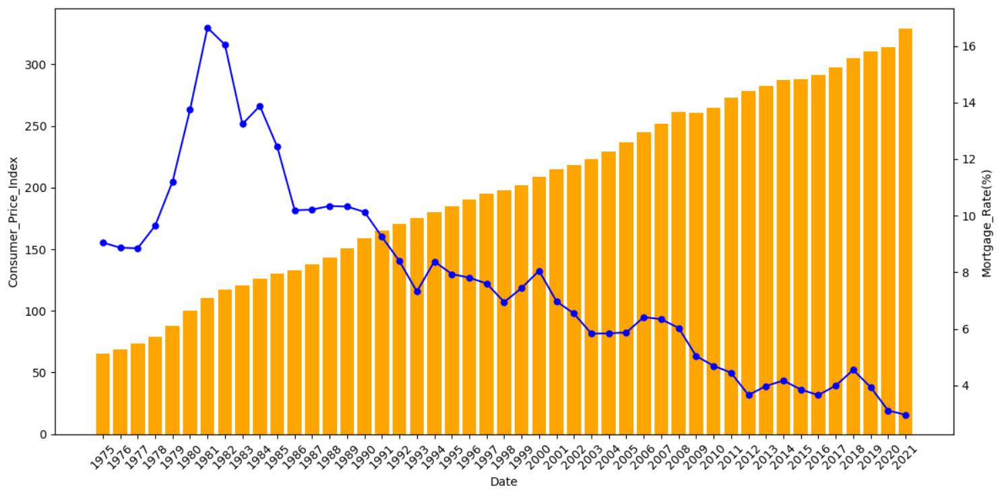

# US Housing Market Macroeconomic Factors Analysis

## Project Overview
This project analyzes the US housing market based on various macroeconomic factors using data from the IBM Data Analyst Professional Certificate on Coursera. The goal is to understand how different economic indicators relate to housing prices over time.

## Dataset Description
The dataset includes the following attributes:

- **Date**: Year
- **House_Price_Index**: House price change relative to the base period
- **Stock_Price_Index**: Stock price change relative to the base period
- **Consumer_Price_Index**: Overall change in consumer prices based on a representative basket of goods and services
- **Population**: Population of USA (thousands)
- **Unemployment_Rate**: Unemployment rate (percentage)
- **Real_GDP**: Inflation-adjusted GDP (billions of chain 2012 dollars)
- **Mortgage_Rate**: Interest rates on mortgages (percentage)
- **Real_Disposable_Income**: Income after taxes (billions of chain 2012 dollars)

## Methodology
- Load and preprocess the data
- Perform exploratory data analysis (EDA)
- Visualize key trends and relationships
- Draw insights and conclusions

## Exploratory Data Analysis

*Consumer Price Index and Mortgage Rate Trends*

## How to Run
1. Clone this repository:git clone https://github.com/yourusername/us_housing_market_analysis.git

2. Install required packages:pip install -r requirements.txt

3. Open and run the notebook:jupyter notebook notebooks/us_housing_macro_analysis.ipynb

